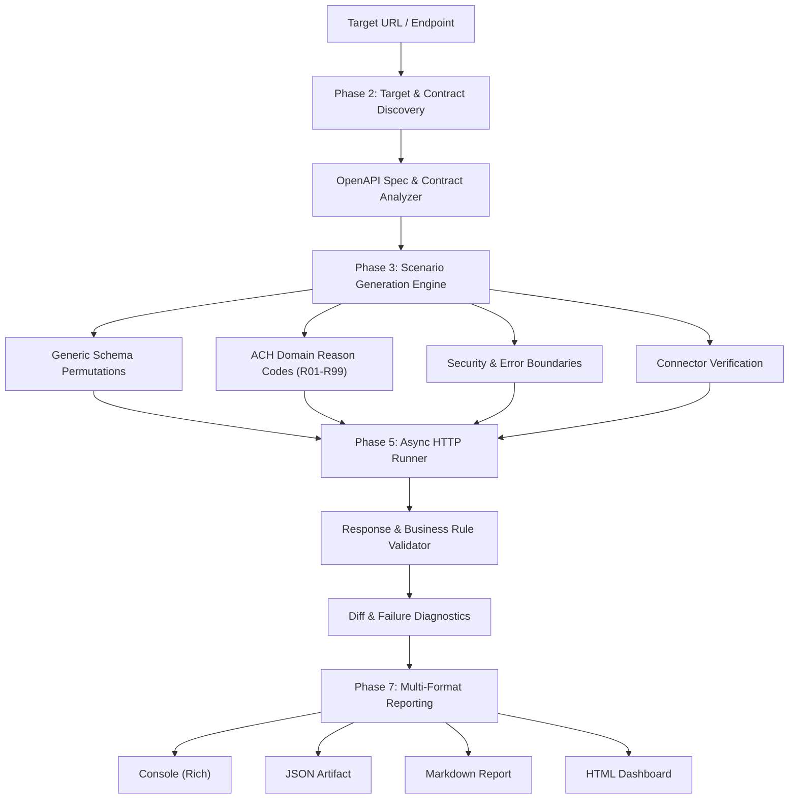

# Return ACH Test Engine

An autonomous, modular, production-ready test engine designed to discover, test, and validate **Return ACH Automation** backends (built on FastAPI and LangGraph).

---

## Table of Contents
- [Architecture Overview](#architecture-overview)
- [Key Capabilities](#key-capabilities)
- [Project Structure](#project-structure)
- [Installation & Setup](#installation--setup)
- [CLI Usage Guide](#cli-usage-guide)
  - [1. API Inspection & Discovery](#1-api-inspection--discovery)
  - [2. Executing Automated Test Runs](#2-executing-automated-test-runs)
  - [3. Re-exporting Reports from JSON](#3-re-exporting-reports-from-json)
- [Configuration Reference](#configuration-reference)
- [Testing Strategy & Suites](#testing-strategy--suites)
- [LangGraph Orchestration Pipeline](#langgraph-orchestration-pipeline)
- [Mock vs. Real Connector Testing](#mock-vs-real-connector-testing)
- [Test Reports & Artifacts](#test-reports--artifacts)
- [Running Self-Tests](#running-self-tests)

---

## Architecture Overview

The Return ACH Test Engine is built as an independent, loosely coupled testing application that treats the backend as a target via HTTP contracts.



---

## Key Capabilities

1. **Flexible Target Targeting**:
   - Accepts either a **Base Backend URL** (e.g. `http://localhost:8000`) or a **Specific Endpoint URL** (e.g. `http://localhost:8000/api/v1/triggers/returned-ach`).
2. **Autonomous OpenAPI Discovery & `$ref` Dereferencing**:
   - Discovers `/openapi.json`, analyzes parameter requirements, regex constraints (`_TRACE`, `ReasonCode`), bounds, and strict model rules.
3. **NACHA ACH Domain-Specific Rules**:
   - Tests standard NACHA return reason codes matrix (`R01`, `R02`, `R03`, `R04`, `R07`, `R08`, `R10`, `R16`, `R20`).
   - Validates trace number shape (6–64 chars alphanumeric), settlement date thresholds (year >= 2000), deduplication idempotency (replays return HTTP 200), and multi-step case lifecycles.
4. **Pluggable Mock & Real Connectors**:
   - Tests external upstream systems (Payment, Servicing, CRM, Risk).
   - Validates in-memory mocks as well as live external endpoints with strict non-destructive read queries and latency SLA enforcement.
5. **LangGraph Workflow Orchestration**:
   - Orchestrates the testing lifecycle via stateful `StateGraph` with conditional routing on target reachability and scenario availability.
6. **Multi-Format Reporting**:
   - Generates interactive Console tables, machine-readable JSON artifacts, GitHub-flavored Markdown reports, and self-contained HTML dashboards.

---

## Project Structure

```text
returned-ach-test-engine/
├── pyproject.toml              # Build & dependency packaging
├── README.md                   # System documentation
├── test_engine/
│   ├── __init__.py
│   ├── cli.py                  # Click CLI entrypoint (ach-test)
│   ├── config.py               # Pydantic Settings configuration management
│   ├── logger.py               # Structured logging & execution trace context
│   ├── models/
│   │   ├── contract.py         # APIContract, EndpointContract, FieldValidationRule
│   │   ├── test_case.py        # TestCase, TestRequest, ExpectedResponse
│   │   ├── result.py           # TestExecutionResult, ValidationOutcome
│   │   └── report.py           # FullTestReport, TestReportSummary
│   ├── discovery/
│   │   ├── resolver.py         # Target URL probe and reachability inspector
│   │   ├── openapi_fetcher.py  # OpenAPI spec fetcher & $ref dereferencer
│   │   └── contract_analyzer.py# Route analyzer and constraint extractor
│   ├── scenarios/
│   │   ├── schema_generator.py # Schema baseline, missing fields, invalid types
│   │   ├── ach_domain_generator.py # NACHA matrix, dates, traces, deduplication
│   │   ├── error_generator.py  # Malformed JSON, 404, 409, 403 identity headers
│   │   └── generator.py        # Unified scenario coordinator
│   ├── connectors/
│   │   ├── base.py             # Connector protocols and result models
│   │   ├── mock_tester.py      # Mock Payment, Servicing, CRM, Risk tester
│   │   ├── real_tester.py      # Live external connector integration harness
│   │   └── workflow_bridge.py  # Workflow evidence packet & registry bridge
│   ├── execution/
│   │   ├── client.py           # Async HTTP client with pooling, retries, timing
│   │   └── runner.py           # Concurrent runner & stateful sequential scheduler
│   ├── validation/
│   │   ├── validator.py        # Multi-dimensional response validator
│   │   └── diff_analyzer.py    # Diff calculator & failure diagnostics
│   ├── orchestration/
│   │   ├── state.py            # LangGraph TestEngineState
│   │   ├── nodes.py            # Workflow nodes (discover, analyze, execute, etc.)
│   │   └── graph.py            # StateGraph assembly & conditional routing
│   └── reporting/
│       └── exporters.py        # Console, JSON, Markdown, HTML exporters
└── tests/
    ├── test_config.py
    ├── test_logger.py
    ├── test_discovery.py
    ├── test_scenarios.py
    ├── test_connectors.py
    ├── test_execution_validation.py
    ├── test_graph.py
    ├── test_reporting.py
    └── test_e2e.py             # Full end-to-end integration tests
```

---

## Installation & Setup

### Prerequisites
- Python >= 3.11
- `uv` (recommended) or `pip`

### Using `uv` (Recommended)
```bash
cd returned-ach-test-engine
uv venv
uv pip install -e ".[dev]"
```

### Using standard `pip`
```bash
cd returned-ach-test-engine
python3 -m venv .venv
source .venv/bin/activate
pip install -e ".[dev]"
```

---

## CLI Usage Guide

The engine installs the `ach-test` executable.

### 1. API Inspection & Discovery
Inspect endpoints and parameter contracts before running tests:

```bash
# Discover all routes and schemas from a base backend URL:
ach-test discover --url http://localhost:8000

# Inspect a specific endpoint:
ach-test discover --url http://localhost:8000/api/v1/triggers/returned-ach
```

### 2. Executing Automated Test Runs
Execute test suites against the target:

```bash
# Full test run against local Return ACH backend:
ach-test run --url http://localhost:8000

# Test a single endpoint URL with schema validation:
ach-test run --url http://localhost:8000/api/v1/triggers/returned-ach --suites schema

# Run ACH domain business rules and connectors in real mode:
ach-test run --url http://localhost:8000 --mode real --suites ach_domain --suites connectors

# High concurrency with custom report formats and output directory:
ach-test run --url http://localhost:8000 --concurrency 10 --output-dir ./test-artifacts -f html -f markdown -f json

# Run using a YAML configuration file:
ach-test run --config config.yaml
```

### 3. Re-exporting Reports from JSON
Generate HTML or Markdown reports from an existing test artifact without re-running tests:

```bash
ach-test report --input reports/report.json --output-dir ./exports --format html --format markdown
```

### 4. Interactive Web Dashboard (Frontend)
Launch the built-in interactive web UI dashboard:

```bash
# Start web server on port 8080:
ach-test ui --port 8080

# Or run with auto-reload:
ach-test ui --port 8080 --reload
```
Open **[http://localhost:8080](http://localhost:8080)** to interactively:
- Configure target backend URL, connector modes, and suites.
- Click **"Discover API Contracts"** to inspect schemas and parameter requirements.
- Click **"Run Test Engine"** to trigger live tests and view real-time pass/fail metrics.
- Inspect any test scenario's full request, response, validation diffs, and execution traces.
- Download reports in JSON, Markdown, or HTML.

---

## Configuration Reference

Settings can be specified via **CLI flags**, **environment variables** (prefixed with `ACH_TEST_`), or a **YAML config file**:

| Setting | CLI Flag | Env Variable | Default | Description |
|---|---|---|---|---|
| Target URL | `--url` / `-u` | `ACH_TEST_TARGET_URL` | `http://localhost:8000` | Backend base URL or specific endpoint |
| Execution Mode | `--mode` / `-m` | `ACH_TEST_EXECUTION_MODE` | `mock` | Connector mode (`mock` or `real`) |
| Test Suites | `--suites` / `-s` | `ACH_TEST_SUITES` | `["health", "schema", "ach_domain", "security", "connectors"]` | Active suites |
| Max Concurrency | `--concurrency` / `-c` | `ACH_TEST_MAX_CONCURRENCY` | `5` | Semaphore limit for async requests |
| Timeout (seconds)| `--timeout` / `-t` | `ACH_TEST_TIMEOUT_SECONDS` | `15.0` | Request timeout |
| Output Directory | `--output-dir` / `-o` | `ACH_TEST_OUTPUT_DIR` | `reports` | Path where reports are written |
| Report Formats | `--format` / `-f` | `ACH_TEST_REPORT_FORMATS` | `["console", "json", "markdown", "html"]` | Enabled report types |
| User ID | - | `ACH_TEST_AUTH_USER_ID` | `usr_test_operator_01` | Injected into `X-User-Id` |
| Tenant ID | - | `ACH_TEST_TENANT_ID` | `tenant_qa_01` | Tenant ID for multi-tenant requests |

---

## Testing Strategy & Suites

1. **`health`**: Verifies API availability, `/api/v1/health` status, and connectivity.
2. **`schema`**: Generates valid baseline payloads, missing required field permutations (422), invalid types (422), boundary violations (empty string, length overflows), strict extra fields rejection, and invalid HTTP verbs (405).
3. **`ach_domain`**:
   - NACHA return reason codes matrix (`R01` to `R20`).
   - Shape validators: `ReasonCode` regex, `_TRACE` alphanumeric regex.
   - Settlement dates validator (rejecting dates before year 2000).
   - Deduplication: verifies initial submission returns 201 Created, while identical replay returns 200 OK.
4. **`lifecycle`**: Stateful multi-step workflow flow:
   - Step 1: `POST /api/v1/triggers/returned-ach` (extracts `case_id`).
   - Step 2: `GET /api/v1/cases/{case_id}` (verifies case state).
   - Step 3: `GET /api/v1/tasks?case_id={case_id}` (verifies review task creation).
5. **`security` / `error_handling`**: Missing identity headers (`X-User-Id`), non-existent resources (404 ErrorEnvelope), stale revision conflicts (409), malformed JSON payloads.
6. **`connectors`**: Tests Payment, Servicing, CRM, and Risk connector integrations.

---

## LangGraph Orchestration Pipeline

The engine leverages LangGraph for clean, resilient, stateful workflow management:

```text
Input Backend/Endpoint URL
            ↓
       discover_api
            ↓
  [route_after_discovery] ──(unreachable)──> generate_report ──> END
            ↓ (reachable)
     analyze_contract
            ↓
    generate_scenarios
            ↓
  [route_after_scenarios] ──(empty)────────> generate_report ──> END
            ↓ (has cases)
      execute_tests
            ↓
    validate_responses
            ↓
     analyze_failures
            ↓
     generate_report
            ↓
           END
```

---

## Mock vs. Real Connector Testing

- **Mock Mode (`--mode mock`)**:
  - Validates determinism of in-memory synthetic data.
  - Verifies sample trace numbers and account queries return expected fixture values.
  - Verifies error resilience on synthetic missing items.
- **Real Mode (`--mode real`)**:
  - Connects to real external systems configured via environment variables:
    - `ACH_TEST_PAYMENT_URL`
    - `ACH_TEST_SERVICING_URL`
    - `ACH_TEST_CRM_URL`
    - `ACH_TEST_RISK_URL`
  - Enforces **strictly non-destructive read operations** to protect production systems against unintended mutations.
  - Measures live network round-trip latencies against latency SLA gates (`max_sla_ms`).

---

## Test Reports & Artifacts

After each run, the engine writes self-contained artifacts to the output directory:
- **`report.json`**: Complete machine-readable data containing serialized requests, responses, diffs, and execution metrics.
- **`report.md`**: GitHub-flavored markdown report suitable for CI/CD summaries and pull request comments.
- **`report.html`**: Interactive HTML dashboard with KPI cards, pass/fail badges, and collapsible diagnostic drawers.

---

## Running Self-Tests

To run the complete test suite for the test engine:

```bash
cd returned-ach-test-engine
.venv/bin/pytest -v
```

All 37 unit and integration tests pass with 0 warnings.
